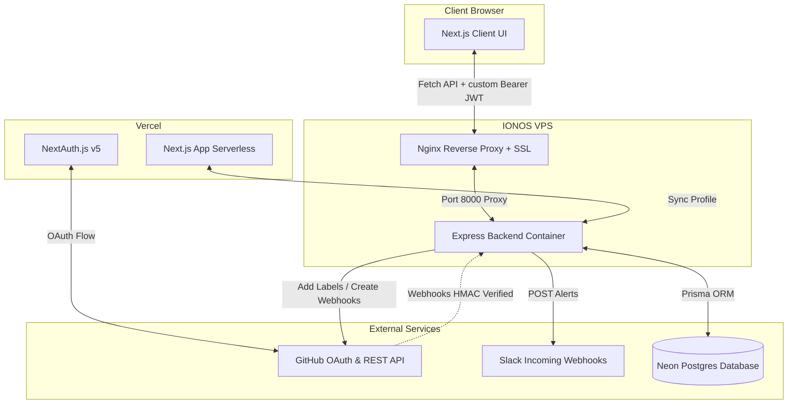

# 🤖 GITBOT — Webhook Automation Engine & Dashboard

GITBOT is a secure, full-stack GitHub webhook automation system. It allows users to authenticate using GitHub, connect their repositories, and set up dynamic, conditional rules (e.g., automatically adding issue labels or sending Slack notifications when issues or PRs containing matching titles, descriptions, or authors are received).

The system is split into two components:
1. **Frontend**: Next.js 14 (App Router) client application deployed on Vercel.
2. **Backend**: Node.js/Express server containerized with Docker and deployed behind an Nginx reverse proxy with Let's Encrypt SSL on an IONOS VPS.

---

## 🚀 Live URLs

* **Web Application (Vercel)**: [https://gitbot-frontend.vercel.app](https://gitbot-frontend.vercel.app)
* **Backend API Gateway (VPS)**: [https://api.arghyadip.com/health](https://api.arghyadip.com/health)

---

## 🛠️ Tech Stack & Architecture



### Key Technical Systems
* **NextAuth Custom JWT Bridge**: NextAuth handles OAuth authentication on the frontend. The standard JWE session token is overridden to produce an HS256 signed JWS token using a shared secret. The Express backend uses `jose` to instantly decode and verify the token without database queries.
* **Security & Timing-Safe HMAC Verification**: Webhooks from GitHub are verified on the backend using timing-safe byte comparison (`crypto.timingSafeEqual`) on the `sha256` digest header of the raw body payload.
* **Idempotency Guard**: Every incoming GitHub webhook has a unique `X-GitHub-Delivery` delivery ID. The database enforces uniqueness, preventing duplicate rule processing if GitHub delivers the same payload twice.
* **Dynamic Rule Engine**: Matches webhook payloads against user-defined database rules (case-insensitive checking on event headers, title, description, or author, supporting wildcard `*` criteria).

---

## 📁 Repository Structure

```
GITBOT/
├── Backend/          # Node.js + Express + Prisma + Dockerfile
│   ├── prisma/       # Database Schema & Migrations
│   ├── src/
│   │   ├── middleware/ # Shared JWS Auth Token verifier
│   │   └── routes/   # Auth, Webhooks, Repos, Rules, and Activity timeline
│   └── .env.example
├── Frontend/         # Next.js 14 + Tailwind CSS + NextAuth + Dockerfile
│   ├── src/
│   │   ├── app/      # Page layout, auth routes, and Dashboard panels
│   │   └── auth.ts   # NextAuth OAuth & token-signing configuration
│   └── .env.example
└── README.md         # Documentation
```

---

## 🔧 Local Development Setup

### Prerequisites
* Node.js v18 or later
* PostgreSQL database (Local or Neon)
* A registered GitHub OAuth App
* A Slack incoming webhook URL (optional)

### 1. Database Setup
Ensure you run migrations and generate the client on your Postgres database:
```bash
cd Backend
npm install
npx prisma migrate dev
```

### 2. Configure Environment Variables
Copy `.env.example` to `.env` in both folders and fill in the values:
* **Backend (`Backend/.env`)**: Define `DATABASE_URL`, `NEXTAUTH_SECRET` (matches frontend secret), `GITHUB_WEBHOOK_SECRET` (any secure string), `BACKEND_PUBLIC_URL` (your local ngrok forwarder), and `SLACK_WEBHOOK_URL`.
* **Frontend (`Frontend/.env.local`)**: Define `AUTH_SECRET`, `AUTH_GITHUB_ID`, `AUTH_GITHUB_SECRET`, and `NEXT_PUBLIC_BACKEND_URL`.

### 3. Running Services
* **Start Backend**:
  ```bash
  cd Backend
  npm run dev
  # Starts on http://localhost:8000
  ```
* **Start Frontend**:
  ```bash
  cd Frontend
  npm run dev
  # Starts on http://localhost:3000
  ```

---

## 🌐 Production Deployment Guide

### Frontend (Vercel)
1. Import the `Frontend` folder into a new project in the Vercel dashboard.
2. Configure the environment variables matching `Frontend/.env.example`.
3. Set `NEXT_PUBLIC_BACKEND_URL` and `BACKEND_INTERNAL_URL` to `https://api.arghyadip.com`.
4. Deploy.

### Backend (IONOS VPS / Ubuntu)
1. **Build Docker Image on VPS**:
   ```bash
   cd /var/www/gitbot-backend/GITBOT_BACKEND/
   docker build -t gitbot-backend .
   ```
2. **Run Backend Container**:
   ```bash
   docker run -d --name gitbot-backend --restart unless-stopped -p 8000:8000 --env-file /var/www/gitbot-backend/GITBOT_BACKEND/.env gitbot-backend
   ```
3. **Configure Nginx Site Block (`/etc/nginx/sites-available/gitbot`)**:
   ```nginx
   server {
       listen 80;
       server_name api.arghyadip.com;

       location / {
           proxy_pass http://localhost:8000;
           proxy_http_version 1.1;
           proxy_set_header Upgrade $http_upgrade;
           proxy_set_header Connection "upgrade";
           proxy_set_header Host $host;
           proxy_set_header X-Real-IP $remote_addr;
           proxy_set_header X-Forwarded-For $proxy_add_x_forwarded_for;
           proxy_set_header X-Forwarded-Proto $scheme;
       }
   }
   ```
4. **Enable & Secure**:
   ```bash
   ln -sf /etc/nginx/sites-available/gitbot /etc/nginx/sites-enabled/gitbot
   nginx -t
   systemctl reload nginx
   certbot --nginx -d api.arghyadip.com --agree-tos --email arghya.dev.contact@gmail.com --non-interactive
   ```

---

## 🧪 Testing Instructions

1. **Sign In**: Navigate to [https://gitbot-frontend.vercel.app](https://gitbot-frontend.vercel.app) and sign in using your GitHub account.
2. **Connect Repository**: Find your repository from the left panel and click **Connect**. This automatically registers the webhook URL on GitHub with the events `["issues", "pull_request", "push", "issue_comment", "pull_request_review", "pull_request_review_comment"]`.
3. **Add Automation Rules**:
   * Click on the connected repository to open the configuration panel.
   * Add a rule, for example:
     * **Event Type**: `issues`
     * **Match Field**: `title`
     * **Match Value**: `bug`
     * **Label to Add**: `bug`
     * **Send Slack Notification**: Enable
4. **Simulate/Verify webhook**:
   * In the connected repository, click **Trigger Webhook Ping**. This triggers GitHub's test webhook suite which replays the last commit payload.
   * Alternatively, open a real issue in your GitHub repository containing the word `bug` in the title.
   * Observe the **Activity Log Timeline** at the bottom of the dashboard. It will show the webhook receipt, payload details, rule processing match, and success logs of the corresponding actions taken (e.g., Slack post status, label added).
